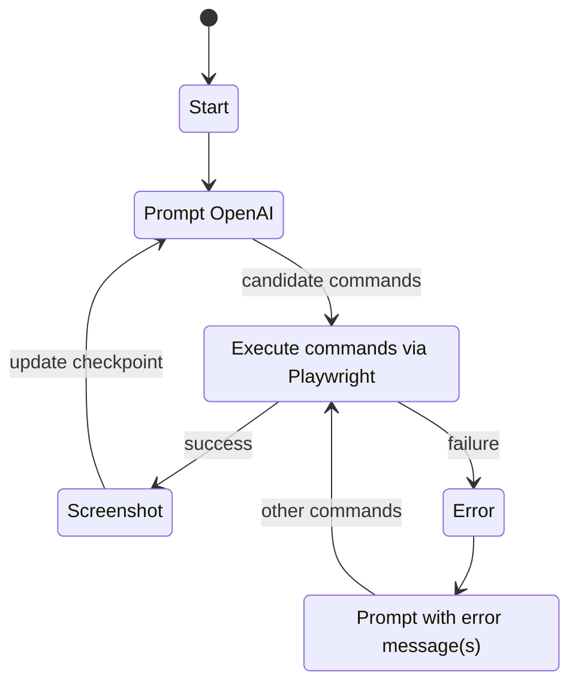

# english2playwright

## How does it work?

```mermaid
stateDiagram-v2
    Prompt: Prompt OpenAI
    PromptError: Prompt with error message(s)
    Playwright: Execute commands via Playwright

    [*] --> Start
    Start --> Prompt
    Prompt --> Playwright: candidate commands
    Playwright --> Screenshot: success
    Screenshot --> Prompt: update checkpoint

    Playwright --> Error: failure
    Error --> PromptError
    PromptError --> Playwright: other commands
```
