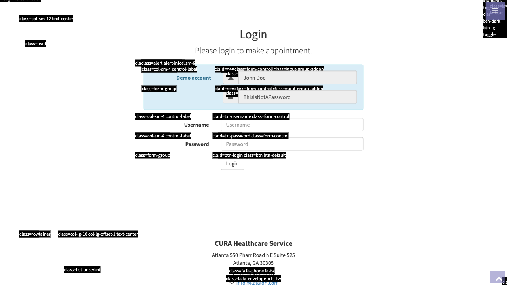

# Cura Healthcare

Write test script to make appointment on website https://katalon-demo-cura.herokuapp.com

```javascript
const { chromium } = require("playwright");

(async () => {
  const browser = await chromium.launch({ channel: "chrome" });
  const page = await browser.newPage({ screen: { width: 600, height: 400 } });
  await page.goto("https://katalon-demo-cura.herokuapp.com");
  await page.click("#btn-make-appointment");
  // Fill in the username
  await page.fill("#txt-username", "John Doe");

  // Fill in the password
  await page.fill("#txt-password", "ThisIsNotAPassword");

  // Click the login button
  await page.click("#btn-login");
  await page.selectOption(
    ".form-group .form-control",
    "Hongkong CURA Healthcare Center"
  );
  await page.click("#radio_program_medicaid");
  await page.click(".glyphicon-calendar");
  // Click on a specific date in the date picker
  await page.click("text='20'");
  // Fill in the comment section using the id of the textarea
  await page.fill("#txt_comment", "This is a test comment.");
  // Click the 'Book Appointment' button
  await page.click("#btn-book-appointment");

  try {
    await browser.close();
  } catch (e) {}
})();
```

## Cost

- Total request: `12`
- Total cost: `$0.19968000000000002`

## Prompts

<table border="1"><tr><td></td><td>

Write test script to make appointment on website https://katalon-demo-cura.herokuapp.com

</td></tr><tr><th>1</th><td>

To begin the test script for making an appointment on the website https://katalon-demo-cura.herokuapp.com, we first need to navigate to the website:

```javascript
await page.goto("https://katalon-demo-cura.herokuapp.com");
```

</td></tr><tr><td></td><td>


</td></tr><tr><th>2</th><td>

Based on the requirement and the screenshot provided, the first step in the test script would be to click on the "Make Appointment" button. Here is the Playwright command to perform this action:

```javascript
await page.click('#btn-make-appointment');
```

Please provide the next screenshot after executing this command.

</td></tr><tr><td></td><td>



</td></tr><tr><th>3</th><td>

Based on the screenshot provided, it looks like we are on the login page of the website. The next step in the test script would be to fill in the username and password fields and then click the login button. Since the demo account credentials are provided on the page, we can use those for the test.

Here's the next part of the Playwright script:

```javascript
// Fill in the username
await page.fill('#txt-username', 'John Doe');

// Fill in the password
await page.fill('#txt-password', 'ThisIsNotAPassword');

// Click the login button
await page.click('#btn-login');
```

Please provide the next screenshot after executing these commands.

</td></tr><tr><td></td><td>


</td></tr><tr><th>4</th><td>

Based on the screenshot provided, the next step in the Playwright script would be to select a facility from the dropdown menu. Here's the Playwright command to select the first facility option:

```javascript
await page.selectOption('.form-group .form-control', 'Hongkong CURA Healthcare Center');
```

Please execute this command and provide the next screenshot.

</td></tr><tr><td></td><td>


</td></tr><tr><th>5</th><td>

Based on the screenshot provided, the next step in the automation script would be to select a healthcare program. Since the radio buttons are visible in the screenshot, you can use the IDs provided to select one of the options. Let's choose the "Medicaid" program for this example.

Here's the Playwright command to select the "Medicaid" radio button:

```javascript
await page.click('#radio_program_medicaid');
```

Please execute this command and provide the next screenshot.

</td></tr><tr><td></td><td>


</td></tr><tr><th>6</th><td>

The next step in the script is to interact with the date picker to select a visit date. Since the website uses a custom date picker, we should trigger it and then click the buttons to set the date. Let's open the date picker first.

Please add the following command to the script to click on the calendar icon and open the date picker:

```javascript
await page.click('.glyphicon-calendar');
```

Execute this command, and then provide the screenshot of the date picker that appears.

</td></tr><tr><td></td><td>


</td></tr><tr><th>7</th><td>

Based on the screenshot provided, it looks like the date picker is open. To continue with the automation script, you would select a date from the date picker. Since I cannot interact with the screenshot, I will provide you with the next Playwright command that would typically be used to select a date. You would replace 'DATE_SELECTOR' with the actual selector for the date you want to select.

```javascript
// Select a date from the date picker
await page.click('DATE_SELECTOR');
```

Please replace 'DATE_SELECTOR' with the appropriate selector for the date you want to choose, such as `text='15'` if you want to select the 15th of the month displayed in the date picker. If you provide the next screenshot after executing this command, I can continue to assist with the next steps.

</td></tr><tr><td></td><td>

<!--  -->

```json
{"error":"page.click: Timeout 30000ms exceeded"}
```

</td></tr><tr><th>8</th><td>

It seems there was an error with the date selector. Let's try selecting a specific date from the date picker using a more appropriate selector. Since the screenshot shows the calendar open and we need to select a date, we'll use the text-based selector to click on a specific date. Let's choose November 20, 2023, for the appointment.

```javascript
// Click on a specific date in the date picker
await page.click("text='20'");
```

</td></tr><tr><td></td><td>


</td></tr><tr><th>9</th><td>

The next step in the script would be to fill in the comment section. Since the comment box is highlighted with a black box and its class attribute is visible, you can use the class selector to target the comment input.

Add the following Playwright command to fill in the comment:

```javascript
// Fill in the comment section
await page.fill('.form-control', 'This is a test comment.');
```

After this command, you would typically want to submit the appointment form by clicking the "Book Appointment" button. The button has the id `btn-book-appointment`, so you can use that to target the button.

```javascript
// Click the 'Book Appointment' button
await page.click('#btn-book-appointment');
```

This would complete the process of making an appointment on the website.

</td></tr><tr><td></td><td>

<!--  -->

```json
{"error":"page.fill: Error: Element is not an <input>, <textarea> or [contenteditable] element"}
```

</td></tr><tr><th>10</th><td>

It seems there are multiple elements with the class `.form-control`, and the first one encountered is not an input, textarea, or contenteditable element. To target the comment input specifically, we should use a more precise selector. Let's try selecting the comment input by its id attribute.

```javascript
// Fill in the comment section using the id of the textarea
await page.fill('#txt_comment', 'This is a test comment.');
```

</td></tr><tr><td></td><td>


</td></tr><tr><th>11</th><td>

The next step in the test script would be to click the "Book Appointment" button. Here's the Playwright command to do that:

```javascript
// Click the 'Book Appointment' button
await page.click('#btn-book-appointment');
```

Please execute this command and provide the screenshot of the result.

</td></tr><tr><td></td><td>


</td></tr><tr><th>12</th><td>

The screenshot shows the "Appointment Confirmation" page of the CURA Healthcare Service website. It confirms that an appointment has been booked with the following details:

- Facility: Hongkong CURA Healthcare Center
- Apply for hospital readmission: No
- Healthcare Program: Medicaid
- Visit Date: 20/11/2023
- Comment: This is a test comment.

The confirmation page also includes a button labeled "Go to Homepage."

If you need to continue with the test script or perform additional actions, please provide further instructions. Otherwise, the current test script has successfully navigated through the appointment booking process and reached the confirmation page.

</td></tr></table>
